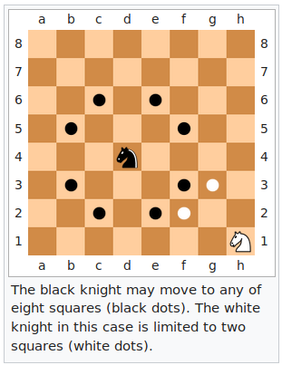

**Knight's Path problem solution**
=============

Implement a program that finds the shortest path a knight can take between two points on a standard 8x8 chessboard.

In chess, knights move in an L-shape: 2 squares along one dimension, 1 square along the other.



Functional Requirements
-----------------------

  - Write a command-line executable that reads instructions from standard input (stdin).
  - Instructions are lines (separated by newlines) in the following format:
```
D4 G7
D4 D5
```

Clone this repository and inside the repository's root folder run:
```
python knightproblem.py
```

# or
```
python3 knightproblem.py
```
To run the Test case : 
```
python -m unittest test_knightproblem.py
```
Install pycharm.
```
create a new project in pycharm and add these three code folders in there and then run the code you can get result
```
Thank you.